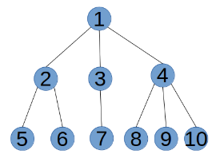
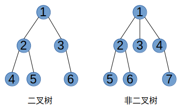
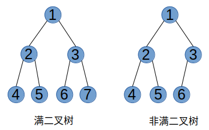
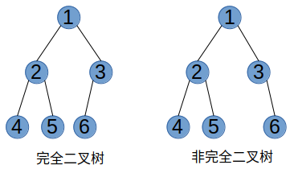
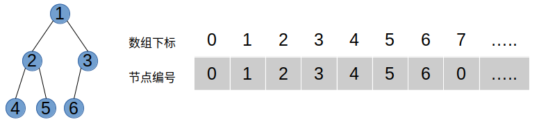
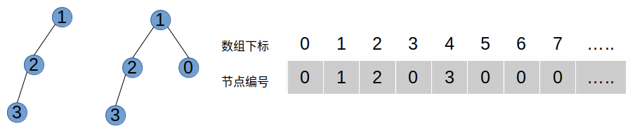
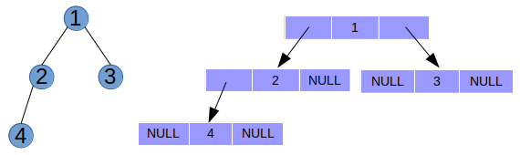
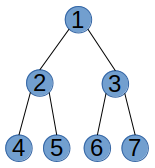

### 数据的逻辑结构

&emsp;&emsp;数据的逻辑结构是指反映数据元素之间的逻辑关系的数据结构，其中的逻辑关系是指数据元素之间的前后间关系，而与他们在计算机中的存储位置无关。逻辑结构包括：

1. **线性结构**：数据结构中的元素存在一对一的相互关系。
2. **树形结构**：数据结构中的元素存在一对多的相互关系。
3. **图形结构**：数据结构中的元素存在多对多的相互关系。
4. **集合**：数据结构中的元素之间除了“同属一个集合”的相互关系外，别无其他关系。

### 树

&emsp;&emsp;对于链表、栈、队列这些数据结构，它们的每个节点都只有一个后继，都是一对一的数据结构，因此属于线性结构。树与它们不同，树中的一个节点可能存在多个后继，是一种一对多的数据结构，属于树形结构。下图是一颗树的逻辑结构图：



下面是关于树的一些基本概念：

* **根节点**：树中最顶上的节点，上图中1号节点是该树的根节点。
* **叶子节点**：树中没有后继的节点，上图中5、6、7、8、9、10号节点是该树的叶子节点。
* **子节点**：树中某个节点的后继叫做该节点的子节点，也叫孩子节点，上图中2、3、4号节点是1号节点的子节点，5、6号节点是2号节点的子节点，叶子节点没有子节点。
* **父节点**：如果a节点是b节点的子节点，那么b节点是a节点父节点，也叫双亲节点，上图中1号节点是2、3、4号节点的父节点，根节点是树中唯一一个没有父节点的节点。
* **兄弟节点**：树中父节点是同一个节点的节点，互称为兄弟节点，上图中2、3、4号节点之间可互称为兄弟节点，5、6号节点之间也可以互称为兄弟节点。
* **节点的度**：树中节点的子节点个数称为该节点的度，上图中4号节点的度为3，3号节点的度为1，叶子节点的度为0。
* **树的层**：从根节点开始，根节点称为树的第1层，根节点的子节点称为树的第2层，根节点的子节点的子节点称为树的第3层，以此类推。
* **树的深度**：树的最大层数叫做树的深度，也叫树的高度。
* **子树**：树中，以根节点的子节点为根节点，构成的一颗新的树，叫做该树的子树，上图中的树有3棵子树，分别是以2、3、4号号节点为根节点的树。
* **空树**：没有节点的树叫做空树。
* **有序树和无序树**：如果树中节点的子节点从左到右看，谁在左边，谁在右边，是有顺序的，则这棵树称为有序树；反之称为无序树。

### 二叉树

&emsp;&emsp;二叉树是一种特殊的树，二叉树是所有节点最多只有两个子节点的有序树，这两个节点分别叫做二叉树的左孩子节点和右孩子节点。下图是两棵树，左边的是一颗二叉树，右边的不是，因为右边树的1号节点有3个子节点。要注意的是，二叉树是有序树，所以二叉树的左右孩子节点不能交换。



&emsp;&emsp;二叉树中，以根节点的左孩子为根节点构成的子树，叫做该二叉树的左子树，右子树的定义类似。下面介绍两种特殊的二叉树。
* **满二叉树**：如果二叉树中除了叶子节点，每个节点的度都为2，则此二叉树称为满二叉树。下图中左边二叉树是一棵满二叉树，右边的二叉树由于3号节点的度为1，所以不是一颗满二叉树。



* **完全二叉树**：如果二叉树中除去最后一层节点为满二叉树，且最后一层的节点依次从左到右没有空缺，则此二叉树被称为完全二叉树。下图中左边二叉树是一棵完全二叉树，右边的二叉树由于最后一层的5号节点和6号节点空了一个节点，所以不是一颗完全二叉树。



### 二叉树的存储结构

&emsp;&emsp;二叉树的存储结构有两种，分别为顺序存储和链式存储。

**顺序存储**：

&emsp;&emsp;二叉树的顺序存储，指的是使用顺序表（一般是数组）存储二叉树。需要注意的是，顺序存储只适用于完全二叉树。换句话说，只有完全二叉树才可以使用顺序表存储。因此，如果我们想顺序存储普通二叉树，需要提前将普通二叉树转化为完全二叉树。

&emsp;&emsp;完全二叉树的顺序存储，仅需从根节点开始，按照层次依次将树中节点存储到数组即可。下图是一个例子，要注意的是，根节点存在下标为1的空间，下标为0的的空间是不用的。



&emsp;&emsp;普通二叉树转完全二叉树的方法很简单，只需给二叉树额外添加一些空节点，将其“拼凑”成完全二叉树，然后按存储完全二叉树那样来存储普通二叉树就好了。如下图所示，左边是普通二叉树，中间是转化后的完全二叉树，右边是存储示意图。



&emsp;&emsp;从顺序表中还原完全二叉树也很简单。完全二叉树具有这样的性质，将树中节点按照层次并从左到右依次编号（1,2,3,...），若编号为i节点有左右孩子，则其左孩子节点的编号为2×i，右孩子节点的编号为2×i+1，反过来，如果i不是根节点，则其父节点的编号是i÷2向下取整。

**链式存储**：

&emsp;&emsp;使用顺序存储来存储二叉树的优点是简单方便，但是普通二叉树使用顺序表存储会存在空间浪费的现象，使用链式存储则不会造成这种现象。

&emsp;&emsp;链式存储是用指针来实现的，每个节点除了要存储数据以外，还要存储其左右孩子节点位置信息，下图是一颗二叉树采用链式存储的示意图。



### 二叉树的遍历

&emsp;&emsp;二叉树的遍历方式有4种，先序遍历、中序遍历、后序遍历、层序遍历。

**先序遍历**：

&emsp;&emsp;对于先序遍历，包括以下4个过程：
1. 判读当前树是否为空
2. 访问当前树的根节点
3. 遍历左子树
4. 遍历右子树



&emsp;&emsp;以上图为例，采用先序遍历的思想遍历该二叉树的过程为：

1. 访问该二叉树的根节点，找到1；
2. 访问节点1的左子树，找到节点2；
3. 访问节点2的左子树，找到节点4；
4. 由于访问节点4左子树失败，且也没有右子树，因此以节点4为根节点的子树遍历完成。但节点2还没有遍历其右子树，因此现在开始遍历，即访问节点5；
5. 由于节点5无左右子树，因此节点5遍历完成，并且由此以节点2为根节点的子树也遍历完成。现在回到节点1，并开始遍历该节点的右子树，即访问节点3；
6. 访问节点3左子树，找到节点6；
7. 由于节点6无左右子树，因此节点6遍历完成，回到节点3并遍历其右子树，找到节点7；
8. 节点7无左右子树，因此以节点3为根节点的子树遍历完成，同时回归节点1。由于节点1的左右子树全部遍历完成，因此整个二叉树遍历完成；

&emsp;&emsp;最终该二叉树采用先序遍历得到的序列为：1 2 4 5 3 6 7

&emsp;&emsp;先序遍历可以用递归来实现，下面是先序遍历的一个代码例子。

```cpp
void preorder_traversal(binode *root)
{
	if(root != NULL) //判断该树是否为空树
	{
		printf("%d ", root->data); // 访问当前根节点
		preorder_traversal(root->lchild); // 遍历左子树
		preorder_traversal(root->rchild); // 遍历右子树
	}
}
```

**中序遍历**：

&emsp;&emsp;中序遍历和先序遍历类似，不同的是中序遍历先遍历左子树，再访问当前根节点，最后遍历右子树，其他与先序遍历相同，使用中序遍历遍历上图得到的序列为：4 2 5 1 6 3 7。

**后序遍历**：就是先遍历左子树，再遍历右子树，最后访问当前根节点，使用后序遍历遍历上图得到的序列为：4 5 2 6 7 3 1。

**层序遍历**：

&emsp;&emsp;层序遍历是按照二叉树中的层次从左到右依次遍历每层中的节点。具体的实现思路是：通过使用队列，先将树的根节点入队，如果其左右孩子存在的话，依次将其左孩子和右孩子入队，然后将根节点节点出队。继续取队头，将其左孩子和右孩子入队，直到树中所有节点都出队，出队节点的先后顺序就是层次遍历的最终结果。

&emsp;&emsp;层序遍历上图的二叉树的过程如下：

1. 首先，根节点1入队；
2. 取队头节点1，将其左孩子2和右孩子3分别入队，将队头节点1出队；
3. 取队头节点2，将其左孩子4和右孩子5分别入队，将队头节点2出队；
4. 取队头节点3，将其左孩子6和右孩子7分别入队，将队头节点3出队；
5. 取队头节点4，因为节点4没有左孩子和右孩子，将队头节点4出队就好了；
6. 取队头节点5，节点5没有左孩子和右孩子，将队头节点5出队；
7. 取队头节点6，节点6没有左孩子和右孩子，将队头节点6出队；
8. 取队头节点7，节点7没有左孩子和右孩子，将队头节点7出队；
9. 队列为空，结束遍历。

&emsp;&emsp;最终层遍历得到的序列为：1 2 3 4 5 6 7
